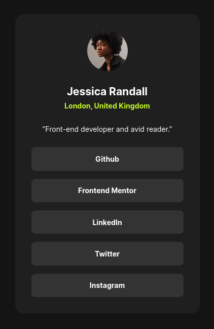

# Frontend Mentor - Social links profile solution

This is a solution to the [Social links profile challenge on Frontend Mentor](https://www.frontendmentor.io/challenges/social-links-profile-UG32l9m6dQ). Frontend Mentor challenges help you improve your coding skills by building realistic projects.

## Table of contents

- [Overview](#overview)
  - [The challenge](#the-challenge)
  - [Screenshot](#screenshot)
  - [Links](#links)
  - [Built with](#built-with)
  - [What I learned](#what-i-learned)
  - [Continued development](#continued-development)
  - [Useful resources](#useful-resources)
- [Author](#author)
- [Acknowledgments](#acknowledgments)

## Overview

### The challenge

Build social links profile section.
Users should be able to:

- See hover and focus states for all interactive elements on the page.

### Screenshot

### Links

- Live Site URL: [View Live Site](https://akashigamedev.github.io/Social_Links_Design_Challenge/)

### Built with

- Semantic HTML5 markup
- CSS custom properties
- Flexbox
- CSS Grid
- Mobile-first workflow

## Author

- Frontend Mentor - [@akashigamedev](https://www.frontendmentor.io/profile/akashigamedev)
- Itch.io - [@akashidev](https://akashidev.itch.io/)
- Instagram - [@yourusername](https://www.instagram.com/akashgoyal_77)
